  

 

 

---

  

---

## 🔥 Contribution Streak

  

---

## 👀 Profile Visitors

  

---

## 🚀 What I'm Working Towards

I'm focused on strengthening my expertise in **Data Science, backend development, and modern web technologies**.

I enjoy solving problems with code, working with data, designing database-driven applications, and continuously expanding my technical knowledge.

My goal is to build software that is not only functional, but **efficient, scalable, and useful**.

---

  <b>💡 Learn. Build. Improve. Repeat.</b>

  ⭐ Thanks for visiting my profile!

