 

  

  

 

## 💻 Welcome to My GitHub Universe!

* 📊 Exploring **Data Science, Data Analysis & Machine Learning**
* ⚙️ Building reliable **backend applications and APIs**
* 🌐 Developing modern **web applications**
* 🐍 Working primarily with **Python**
* 🗄️ Experienced with **SQL & Oracle databases**
* ☕ Building and learning with **Java**
* 🚀 Always improving my programming and problem-solving skills
* 🤝 Open to collaborating on interesting projects
* 📍 Based in **London, United Kingdom**

---

## 🛠️ Languages & Technologies

---

## 📊 GitHub Stats

  
  

---

## 🔥 Contribution Streak

  

---

## 🏆 GitHub Trophies

  

---

## 📈 Contribution Graph

  

---

## 👀 Profile Visitors

  

---

## 🚀 What I'm Working Towards

I'm focused on strengthening my expertise in **Data Science, backend development, and modern web technologies**.

I enjoy solving problems with code, working with data, designing database-driven applications, and continuously expanding my technical knowledge.

My goal is to build software that is not only functional, but **efficient, scalable, and useful**.

---

  <b>💡 Learn. Build. Improve. Repeat.</b>

  ⭐ Thanks for visiting my profile!

